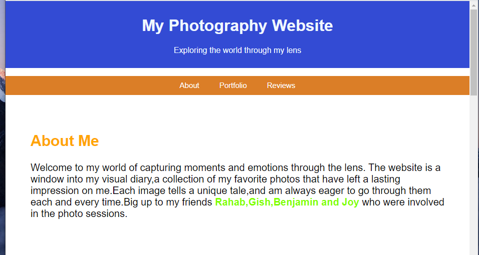
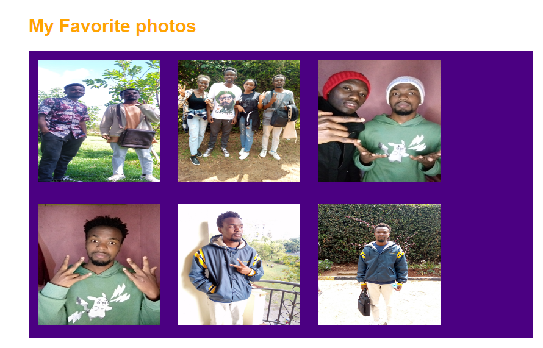
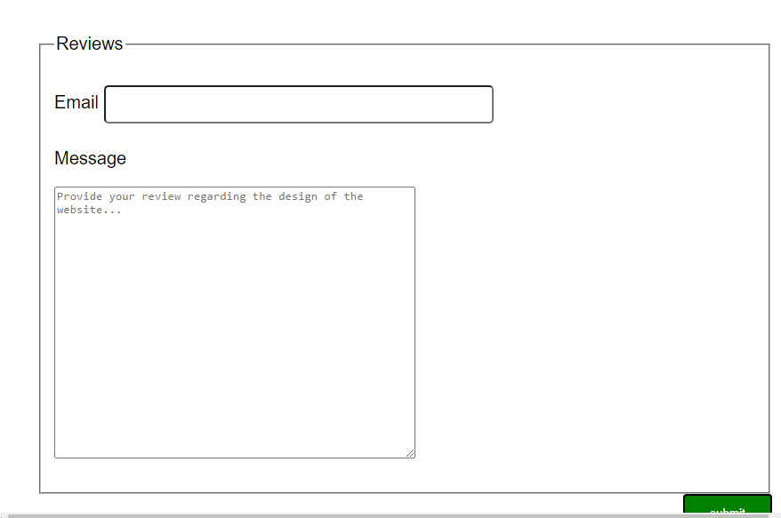

# Photography Portfolio Website
Welcome to my Photography Portfolio Website! This project showcases a collection of my favorite photos, providing viewers with a glimpse into the world as captured through my lens.
## Tools
The website is developed using:
1. HTML5
2. CSS
## Prequisites
To be able to view the website you will need the following.
- A *terminal* for those on `linux` 0r `macOS` and *Gitbash* for those on `windows` 
## Setup
To be able to interact with the website easily follow the steps below:
1. Clone this repository to your local machine using
```
 https://github.com/Issa783/photography-portfolio.git
```

2. Navigate to the project directory:
   ```
   cd photography-portfolio
   ```
3. Open the **index.html** file in your preferred web browser to view the photography portfolio website.
4. Navigate to the **"About"**  section to read what the website is about
5. Navigate to the **"Portfolio"** section to see some of my favorite photos displayed in a visually appealing grid.
6. Also navigate to the **"Reviews"** section to provide your review regarding the design of the website.
## Screenshots
Here are some of the interfaces of my photography website.






## Author
The website is developed and maintained by;
- [John mutua](https://github.com/Issa783)

## Contributions
Contributions are welcome!If you would want to add more features,improve the design,or fix any issues,feel free to open a pull request.
## License
This project is licensed under the [MIT License](https://choosealicense.com/licenses/mit/)


## Contact
For any questions or inquiries,please contact **mutuabenedict920@gmail.com**


